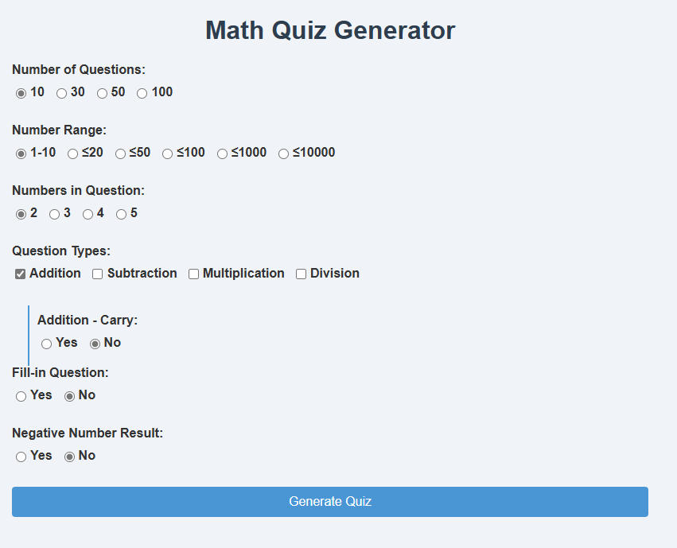

## Math Quiz Generator

**Math Quiz Generator** is a web-based application designed to create customizable math quizzes. This tool allows users to generate quizzes with various types of math problems, including addition, subtraction, multiplication, and division. Users can specify the number of questions, the range of numbers, and the complexity of the problems. The application also supports features like fill-in questions, handling of negative results, and options for carrying in addition and borrowing in subtraction.

## Target audiences
- Primary school year 1 - 3 in Hong Kong, Grade 1-3 in US. 
- Teachers, Parents and student 

### Key Features:
- **Customizable Quizzes**: Choose the number of questions, number range, and types of math problems.
- **Advanced Options**: Support for fill-in questions, negative results, carrying in addition, and borrowing in subtraction.
- **Export Functionality**: Easily export quizzes and results to CSV format for further analysis.
- **Interactive Interface**: User-friendly design with real-time quiz generation and result checking.

---

## 數學題目生成器

**數學測驗生成器**是一個基於網頁的應用程式，旨在創建可自定義的數學測驗。此工具允許用戶生成各種類型的數學問題，包括加法、減法、乘法和除法。用戶可以指定問題數量、數字範圍和問題的複雜性。該應用程式還支持填空題、處理負數結果以及加法進位和減法借位的選項。

## 適用人群
- 小學1至3年級
- 教師, 家長與學生

### 主要功能：
- **可自定義測驗**：選擇問題數量、數字範圍和數學問題類型。
- **高級選項**：支持填空題、負數結果、加法進位和減法借位。
- **導出功能**：輕鬆將測驗和結果導出為CSV格式以便進一步分析。
- **互動界面**：用戶友好的設計，實時生成測驗並檢查結果。

---

Feel free to modify it as needed! 